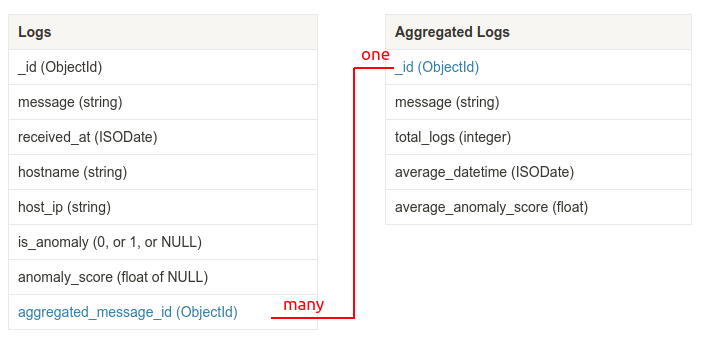

# Log Anomaly Detector

**This project is a fork of [https://github.com/AICoE/log-anomaly-detector/](https://github.com/AICoE/log-anomaly-detector/)**

Log anomaly detector is an open-source project that can connect to streaming sources and produce predictions of abnormal log messages. Internally it uses unsupervised machine learning. We incorporate several machine learning models to achieve this result.

Changes from the original project:
- Python v3.8 support was added
- MongoDB and MySQL as a data source and data sink support was added
- Run analysis in parallel for multiple hosts separately
- UI and Prometheus support was removed
- The usage of Word2Vec algorithm was improved
- The core ML algorithm (SOM) was replaced with ensemble learning of LOF and Autoencoder algorithms

---

**Table of Contents:**

- [Log Anomaly Detector](#log-anomaly-detector)
- [Installation](#installation)
  * [Step 1. Install the package](#step-1-install-the-package)
  * [Step 2. Create a configuration file for LAD](#step-2-create-a-configuration-file-for-lad)
  * [Step 3. Configure log aggregation](#step-3-configure-log-aggregation)
  * [Step 4. Run it as a daemon](#step-4-run-it-as-a-daemon)
- [How it works](#how-it-works)
  * [The LAD daemon and Log aggregator](#the-lad-daemon-and-log-aggregator)
  * [Machine Learning Core](#machine-learning-core)
      + [Word2Vec](#word2vec)
      + [Anomaly detection](#anomaly-detection)
  * [MongoDB Schema Design](#mongodb-schema-design)

# Installation
This installation process was tested on Ubuntu Server LTS 20.04, Python v3.8.10 and MongoDB v5.0.3.

## Step 1. Install the package

This package can be installed as a pip module: 
```bash
pip3 install git+ssh://git@github.com/nadzyah/log-anomaly-detector
pip3 install git+ssh://git@github.com/nadzyah/log-aggregator
```

## Step 2. Create a configuration file for LAD

The configuration file is written in YAML syntax. The variables are explained [here](https://log-anomaly-detector.readthedocs.io/en/latest/configinfo.html)
Since this version of LAD supports MongoDB and parallel multi-host running, there're some additional variables. We recommend to read the [MongoDB Schema Design]((#mongodb-schema-design)) part first.

<table>
  <thead>
    <tr>
      <th>Config field</th>
      <th>Details</th>
    </tr>
  </thead>
  <tbody>
  <tr>
    <td>MG_HOST</td>
    <td>MongoDB server IP address</td>
  </tr>
  <tr>
     <td>MG_PORT</td>
     <td>MongoDB server port</td>
  </tr>
  <tr>
     <td>MG_USER</td>
     <td>MongoDB username (optional)</td>
  </tr>
  <tr>
     <td>MG_PASSWORD</td>
     <td>MongoDB password (optional)</td>
  </tr>
  <tr>
     <td>MG_CA_CERT</td>
     <td>CA certificate location for TLS encryption (optional)</td>
  </tr>
  <tr>
     <td>MG_VERIFY_CERT</td>
     <td>Boolean variable that defines if server's certificate should be verified (optional)</td>
  </tr>
  <tr>
     <td>MG_DB</td>
     <td>MongoDB database where log entries are stored</td>
  </tr>
  <tr>
     <td>MG_COLLECTION</td>
     <td>MongoDB collection where logs from specified hosts are stored</td>
  </tr>
  <tr>
     <td>MODEL_BASE_DIR</td>
     <td>path to the directrory where trained models will be stored</td>
  </tr>
  <tr>
     <td>LOG_SOURCES</td>
     <td>multiple MG_COLLECTION +  multiple HOSTNAMES</td>
  </tr>
  <tr>
     <td>HOSTNAMES</td>
     <td>List of Syslog sources hostames for which log mesagess should be analysed</td>
  </tr>
     <td>MESSAGE_INDEX</td>
     <td>The name of the index where the raw event (log message) is specified</td>
  </tr>
  <tr>
     <td>HOSTNAME_INDEX</td>
     <td>The name of the index where hostname is specified</td>
  </tr>
  <tr>
     <td>DATETIME_INDEX</td>
     <td>The name of the index where event time is specified</td>
  </tr>
  <tr>
     <td>LOF_NEIGHBORS</td>
     <td>LOF n_neighbors (or k_neighbors) hyperparameter. Is 100 by default <b>MODIFY ONLY IF YOU KNOW WHAT YOU'RE DOING</b></td>
  </tr>
  <tr>
     <td>LOF_METRIC</td>
     <td>LOF metric hyperparameter. Is euclidean by default <b>MODIFY ONLY IF YOU KNOW WHAT YOU'RE DOING</b></td>
  </tr>
  </tbody>
</table>

Open `/opt/anomaly_detector/multihost.yaml` file and see an example of the config file:
```yaml
STORAGE_DATASOURCE: mg
STORAGE_DATASINK: mg
MG_HOST: 172.17.18.83
MG_PORT: 27017
MG_USER: dbadmin
MG_PASSWORD: password123
MG_CA_CERT: /home/nadzya/Apps/log-anomaly-detector/config_files/LAD_CA.crt 
MG_VERIFY_CERT: true
MODEL_BASE_DIR: "/opt/anomaly_detector/models/"
MG_DB: "logstoredb"
LOG_SOURCES:
  network_logs:
    HOSTNAMES:
      - "cumulus"
      - "EXOS-VM"
      - "172.17.18.178"
  web_logs:
    HOSTNAMES:
      - "dataform"
  utm_logs:
    HOSTNAMES:
      - "172.17.18.56"
      - "172.17.31.10"
MESSAGE_INDEX: "message"
DATETIME_INDEX: "received_at"
HOSTNAME_INDEX: "hostname"
TRAIN_MAX_ENTRIES: 100000
TRAIN_TIME_SPAN: 2592000
```

In this example, MongoDB server has 172.17.18.83 IP address and 27017 port. It has *logstoredb* database, where the log entries are stored.

The logstoredb has three collections:
- *network_logs*, where logs from the network devices with the hostnames *cumulus*, *EXOS_VM* and *172.17.18.178* are stored
- *web_logs*, where logs from the web-server with the hostname *dataform* are stored
- *utm_logs*, where logs from the UTM devices with the hostnames *172.17.18.56* and *172.17.31.10* are stored

So LAD will get and analyse logs from the specified collection in parallel and separately for each host according to hostnames.

You can modify this file, keeping its stricture.

## Step 3. Configure log aggregation

We also provide a script to aggregate anomaly logs. Check it [here](http://172.17.17.198:3000/nhryshalevich/log-aggregator) To configure it open `/opt/anomaly_detector/aggregator.yaml` file. See the example below:

```yaml
STORAGE_DATASOURCE: mg
STORAGE_DATASINK: mg
MG_HOST: 172.17.18.83
MG_PORT: 27017
MG_INPUT_DB: logstoredb
MG_INPUT_COLS: 
  - web_logs
  - utm_logs
  - network_logs
MG_TARGET_COLS: 
  - web_aggregated
  - utm_aggregated
  - network_aggregated
MG_TARGET_DB: logstoredb
MESSAGE_INDEX: message
DATETIME_INDEX: received_at
HOSTNAME_INDEX: hostname
AGGR_TIME_SPAN: 86400
AGGR_EPS: 0.01
AGGR_MIN_SAMPLES: 2
AGGR_VECTOR_LENGTH: 25
AGGR_WINDOW: 5
```

You must be already familiar with some of the options. See the description to the additional ones:

<table>
  <thead>
    <tr>
      <th>Config field</th>
      <th>Details</th>
    </tr>
  </thead>
  <tbody>
  <tr>
    <td>MG_INPUT_DB</td>
    <td>MongoDB database, where the anomaly logs are located</td>
  </tr>
  <tr>
    <td>MG_TARGET_DB</td>
    <td>MongoDB datadase, where the aggregated logs should be pushed. Usually it's the same as MG_INPUT_DB, but we keep this option in case you want to store aggregated logs in separate DB</td>
  </tr>
  <tr>
    <td>MG_INPUT_COLS</td>
    <td>MongoDB collections, where the anomaly logs are located</td>
  </tr>
  <tr>
    <td>MG_TARGET_COLS</td>
    <td>MongoDB collections, where the aggregated logs should be pushed to</td>
  </tr>
  <tr>
    <td>AGGR_TIME_SPAN</td>
    <td>Number of seconds specifying how far to the past to go to load log entries for aggregation. Is 86400 (24 hours) by default</td>
  </tr>
  <tr>
    <td>AGGR_EPS</td>
    <td>The same as "eps" parameter in DBSCAN algorithm. Is 0.5 by default. <b>MODIFY ONLY IF YOU KNOW WHAT YOU'RE DOING</b></td>
  </tr>
  <tr>
    <td>AGGR_MIN_SAMPLES</td>
    <td>The same as "min_samples" parameter in DBSCAN algorithm. Is 5 by default. <b>MODIFY ONLY IF YOU KNOW WHAT YOU'RE DOING</b></td>
  </tr>
  <tr>
    <td>AGGR_VECTOR_LENGTH</td>
    <td>The same as "size" parameter in Word2Vec algorithm. Is 25 by default. <b>MODIFY ONLY IF YOU KNOW WHAT YOU'RE DOING</b></td>
  </tr>
  <tr>
    <td>AGGR_WINDOW</td>
    <td>The same as "window" parameter in Word2Vec algorithm. Is 5 by default. <b>MODIFY ONLY IF YOU KNOW WHAT YOU'RE DOING</b></td>
  </tr>
  </tbody>
</table>

For example, in the config file, all the anomaly logs from `web_logs` collection will be pushed to `web_aggregated` collection, thus it's important to follow the input-target order.

The aggregation script is run every day at 3:00 p.m. You can change the time in the `/etc/crontab` file.

If you want to aggregate logs right now, execute the next command: `log-aggregator run --config-yaml /opt/anomaly_detector/aggregator.yaml`

## Step 4. Run it as a daemon

To be documented.

# How it works

LAD itself creates *n* parallel processes, where *n* is the number of hosts. Each process retrieves logs in the last 30 days (can be changes under TRAIN_TIME_SPAN variable) for a specified host and trains the model. The limit of logs that can be retrieved for training is 250000 by default and can be changed under TRAIN_MAX_ENTRIES variable. The less this number is, the faster the model trains and less accurate predicts anomalies.

After that LAD periodically checks the DB for new log entries. If the new entry appears, the process checks if it's an anomaly. If the log message is an anomaly, it is updated according to [MongoDB schema design](#mongodb-schema-design).

## The LAD daemon and Log aggregator

The daemon allows you to run LAD in the background and restart the LAD process to train the models with new log messages every midnight.

The aggregation script is scheduled by cron and aggregates linguistically similar logs into one message. Each message is represented as a vector with the usage of Word2Vec library. Then we apply DBSCAN to find similar logs.  All different words and parameters in multiple log messages are substituted with `***` symbols. 

## Machine Learning Core

Read about the original ML Core here: [https://log-anomaly-detector.readthedocs.io/en/latest/model.html](https://log-anomaly-detector.readthedocs.io/en/latest/model.html)

### Word2Vec

In this version of LAD we improved Word2Vec usage. In the original approach, each log message is considered as a word, but since W2V uses context to vectorize words, this approach gives us very strict similarities between logs. As the result, we have vectors that are initialized almost with random numbers, according to the Word2Vec algorithm.

In our approach, we vectorize each word in each log message. Then to get one vector that represents a log message, we calculate the mean vector of all the vectors that represent words in the log message (the mean for each coordinate is calculated separately).

For example, if a log message consists of the next words: "The login failed for user admin" and each word is represented by Word2Vec model the next way:

- The -- `[0,1,1]`
- login -- `[10, 5, 6]`
- failed -- `[-4, 3.7, 0]`
- for -- `[-5, 3.2, 10]`
- user -- `[0, -5.4, 10]`
- admin -- `[44, 7.6, 5]`,

the vector that represents the entire log message is calculated the next way: 
```python
[(0 + 10 - 4 - 5 + 0 + 44)/6, 
(1 + 5 + 3.7 + 3.2 - 5.4 + 7.6)/6, 
(1 + 6 + 0 + 10 + 10 + 5)/6] = [7.5, 2.51667, 5.3333]
```

### Anomaly detection

By default, the LAD developers use SOM algorithm for this task. Here we've switched to ensemble learning with the usage of [Local Outlier Factor](https://www.wikiwand.com/en/Local_outlier_factor) algorithm and [Autoencoder](https://www.wikiwand.com/en/Autoencoder) since we've found it to be more efficient (for POC see the `Notebooks/experiment/LAD_Custom_Experiment.ipynb` file).

## MongoDB Schema Design

We assume that originally logs are stored in a MongoDB collection and each document has the next fields:

- **_id** -- the ObjectId of your log message
- **message** -- a string with the raw log message. This field may be named according to your choice, but the custom name of this field should be specified under MESSAGE_INDEX variable in a configuration file.
- **received_at** -- an ISODate object, which represents the timestamp when a log message was generated (or received by log collector in our case). Since LAD can work in real-time and detect new log messages, it needs to understand how old a log message is. The name of this field in your DB should be specified under DATETIME_INDEX variable.
- **hostname** -- a string with the hostname of Syslog source host. Since this version of LAD finds anomalies in log messages for each host separately (for a better detection result), it needs to understand which messages belong to which hosts.  The name of this field in your DB should be specified under HOSTNAME_INDEX variable.

After processing the logs, LAD updates the original documents with the next fields:

- **is_anomaly** -- an integer (0 or 1) that represents if a log message is anomaly or not
- **anomaly_score** -- a float number that represents how the algorithm is confident that the particular message is an anomaly. It's usually bigger than 1 and can reach millions of points (to know why read how LOF works). But even if the score is close to 1, it still may be an anomaly

Additionally, anomaly logs are aggregated by [log-aggregator](http://git.solidex.minsk.by:3000/nhryshalevich/log-aggregator). It's done separately from the LAD process. After that, it adds aggregated messages to another MongoDB collection. Each document in such collection is an aggregated log message with the next fields:

- **_id** -- the unique ObjectId of each aggregated message
- **message** -- the aggregated message. For instance, the next log messages:
	```json
	"<86>Dec  1 17:15:01 cumulus CRON[25368]: pam_unix(cron:session): session opened for user root by (uid=0)",
    "<86>Dec  1 17:00:01 cumulus CRON[25252]: pam_unix(cron:session): session opened for user user by (uid=0)",
    "<86>Dec  1 16:45:01 cumulus CRON[25136]: pam_unix(cron:session): session opened for user root by (uid=0)",
    "<86>Dec  1 16:30:01 cumulus CRON[25019]: pam_unix(cron:session): session opened for user root by (uid=0)",
    "<86>Dec  1 16:17:01 cumulus CRON[24915]: pam_unix(cron:session): session opened for user cumulus by (uid=0)"
	```
	would be aggregated in such message: `"<86>Dec 1 *** cumulus *** pam_unix(cron:session): session opened for user *** by (uid=0)"`
- **total logs** -- a number of logs that are aggregated in the message
- **average_datetime** -- an ISODate field, which is the mean timestamp of all the timestamps of log messages (as you can remember, the timestamp of a log message stored with the message under "received_at" field in our case)
- **average_anomaly_score** -- a float number. Its name speaks for itself.
- **most_frequent_hostname** -- a string that represents hostname of the host, which generated the biggest part of such messages

Then all the documents with original anomaly messages are updated with **aggregated_message_id** field. So there's a one-to-many relationship between aggregated log messages and original anomaly logs (many log messages are aggregated to one message)



Example of a not processed by LAD document from the collection, where original logs are stored:

```
{
    _id: ObjectId("619e0b9a98144d569b67f23c"),
    message: '<182>Nov  1 19:27:49 dataform  45.146.164.110 - - [01/Nov/2021:19:27:49 +0300] "GET /wp-content/plugins/wp-file-manager/readme.txt HTTP/1.1" 302 483 "-" "Mozilla/5.0 (Windows NT 10.0; Win64; x64) AppleWebKit/537.36 (KHTML, like Gecko) Chrome/78.0.3904.108 Safari/537.36"',
    hostname: 'data.solidex.by',
    host_ip: '172.17.18.151',
    received_at: ISODate("2021-11-01T22:27:49.000Z")
  }
```

Example of processed by LAD documents from the collection, where original logs are stored:

```
[{
    _id: ObjectId("61c47d2757ff236a202eafe6"),
    message: '<158>Dec 23 16:44:01 195-137-160-145 nginx-error 2021/12/23 16:43:58 [error] 30422#30422: *174745 open() "/var/www/solidex.by/public_html/favicon.ico" failed (2: No such file or directory), client: 195.38.23.9, server: , request: "GET /favicon.ico HTTP/1.1", host: "www.solidex.by", referrer: "http://www.solidex.by/wp-content/uploads/2017/07/DHCP_HA.pdf"',
    host_ip: '195.137.160.145',
    hostname: '195-137-160-145.hoster.by',
    received_at: ISODate("2021-12-23T16:44:07.111Z"),
    anomaly_score: 1449301670.409819,
    is_anomaly: 1,
    aggregated_message_id: ObjectId("61cd4a619340d0730f34c562")
  },
  {
    _id: ObjectId("61c0702ee4a7236c39a84278"),
    message: '<158>Dec 15 02:21:39 195-137-160-145 nginx-error 2021/12/15 02:21:35 [error] 520#520: *113682 open() "/var/www/solidex.by/public_html/robots.txt" failed (2: No such file or directory), client: 87.250.224.143, server: , request: "GET /robots.txt HTTP/1.1", host: "www.solidex.by"',
    host_ip: '195.137.160.145',
    hostname: '195-137-160-145.hoster.by',
    received_at: ISODate("2021-12-20T14:59:42.966Z"),
    is_anomaly: 0
  }
]
```

Example of a document from the collection, where aggregated messages are stored:

```
{
    _id: ObjectId("61cd4a619340d0730f34c564"),
    message: '<158>Dec *** *** 195-137-160-145 nginx-error *** *** [error] *** *** open() "/var/www/solidex.by/public_html/favicon.ico" failed (2: No such file or directory), client: *** server: , request: "GET /favicon.ico HTTP/1.1", host: "www.solidex.by", referrer: ***',
    total_logs: 10,
    average_datetime: ISODate("2021-12-24T10:03:17.975Z"),
    most_frequent_hostname: '195-137-160-145.hoster.by',
    average_anomaly_score: 1419581577.4761376,
    was_added_at: ISODate("2021-12-30T08:57:53.846Z")
}
```

